Дисклеймер: впереди очень много фотографий, прям очень много.

## Этап 1

### Как работает интернет: базовые сетевые протоколы

UDP - протокол сетевого уровня 
TCP - протокол транспортного уровня
HTTPS - протокол прикладного уровня
IP - протокол сетевого уровня,
поэтому ответ HTTPS (рис. [-@fig:001]).

{#fig:001 width=70%}

Ранее было упомянуто, что протокол TCP - transmission control protocol - работает на транспортном уровне (рис. [-@fig:002]).

{#fig:002 width=70%}

В адресе типа IPv4 не может быть чисел больше 255, поэтому первые два варианта не подходят (рис. [-@fig:003]).

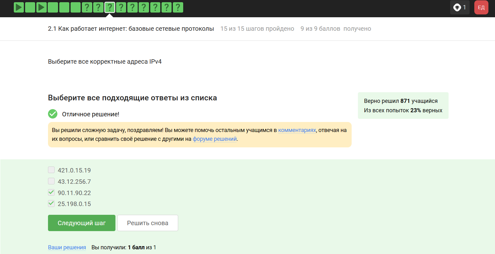{#fig:003 width=70%}

DNS-сервер, Domain name server — приложение, предназначенное для ответов на DNS-запросы по соответствующему протоколу Обязательное условие – Сопоставление сервером доменных имен доменного имени с IP-адресом называется разрешением имени и адреса (рис. [-@fig:004]).

{#fig:004 width=70%}

Распределение протоколов в модели TCP/IP:

- Прикладной уровень (Application Layer): HTTP, RTSP, FTP, DNS.

- Транспортный уровень (Transport Layer): TCP, UDP, SCTP, DCCP.

- Сетевой (Межсетевой) уровень (Network Layer): IP.

- Уровень сетевого доступа (Канальный) (Link Layer): Ethernet, IEEE 802.11, WLAN, SLIP, Token Ring, ATM и MPLS.
(рис. [-@fig:005]).

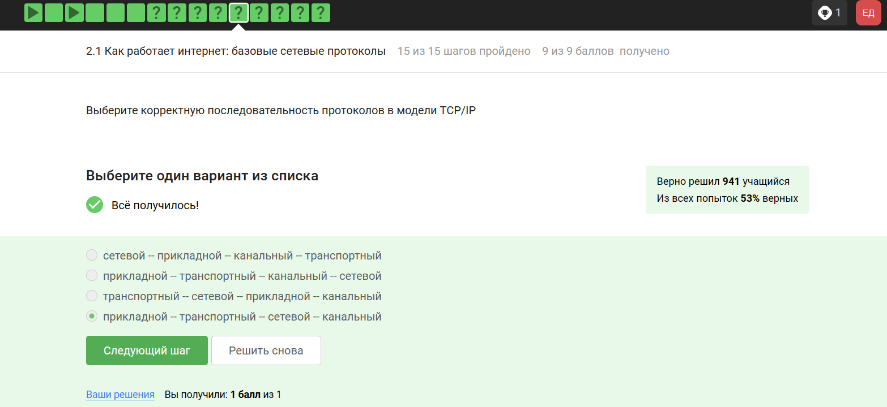{#fig:005 width=70%}

Протокол http передает не зашифрованные данные, а протокол https уже будет передавать зашифрованные данные (рис. [-@fig:006]).

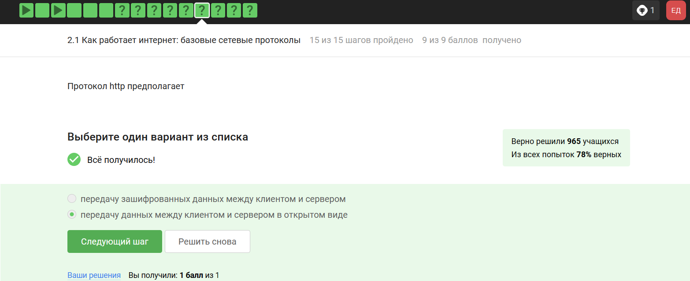{#fig:006 width=70%}

https передает зашифрованные данные, одна из фаз - передача данных, другая должна быть рукопожатием (рис. [-@fig:007]).

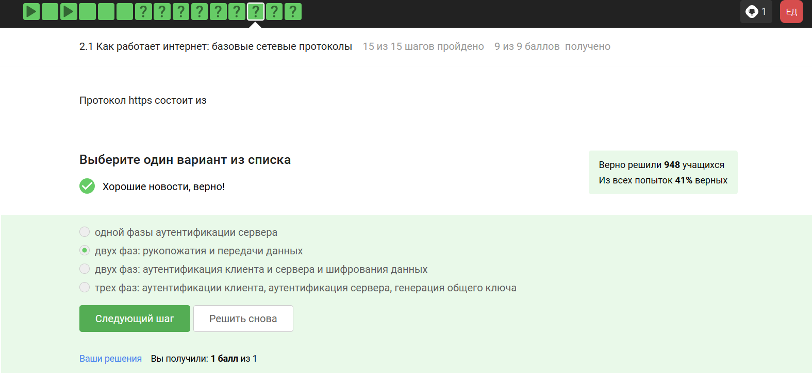{#fig:007 width=70%}

TLS определяется и клиентом, и сервером, чтобы было возможно подключиться (рис. [-@fig:008]).

{#fig:008 width=70%}

Ответ на изображении, остальные варианты в протоколе предусмотрены (рис. [-@fig:009]).

{#fig:009 width=70%}

### Персонализация сети

Куки точно не хранят пароли и IP-адреса, а id ceccии и идентификатор хранят (рис. [-@fig:010]).

{#fig:010 width=70%}

Конечно же, куки не делают соединение более надежным (рис. [-@fig:011]).

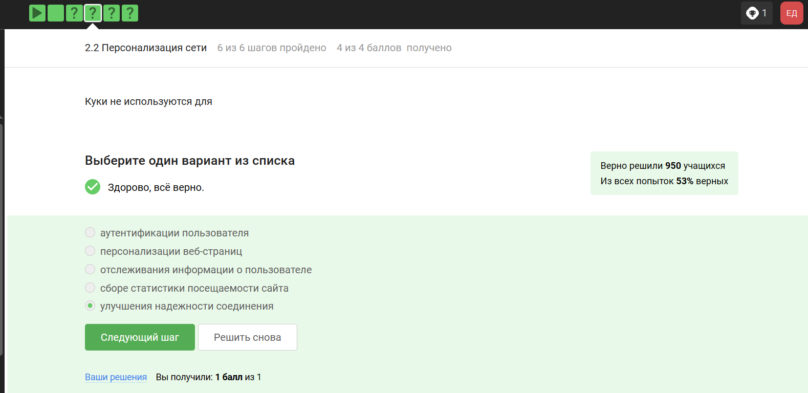{#fig:011 width=70%}

Ответ на изображении (рис. [-@fig:012]).

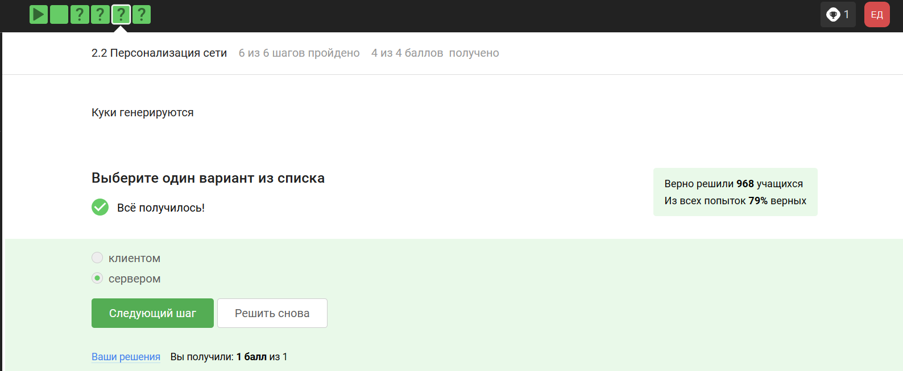{#fig:012 width=70%}

Сессионные куки хранятся в течение сессии, то есть пока используется веб-сайт (рис. [-@fig:013]).

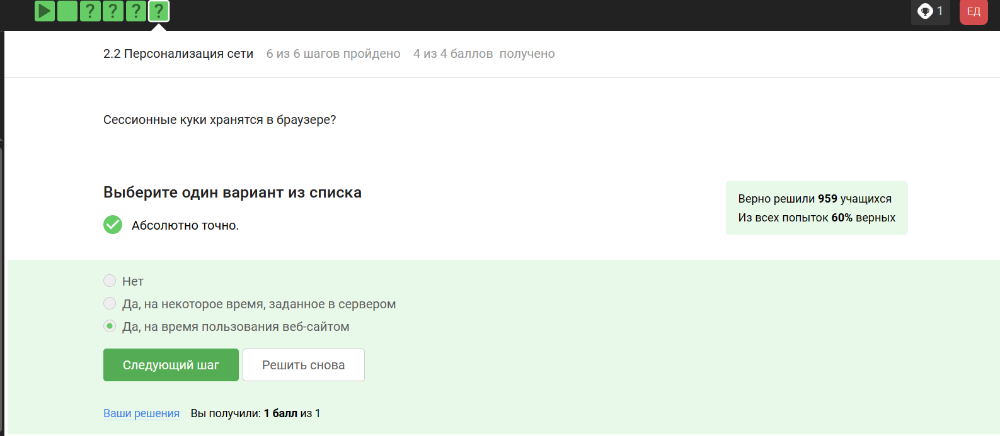{#fig:013 width=70%}

### Браузер TOR. Анонимизация

Необходимо три узла - входной, промежуточный и выходной (рис. [-@fig:014]).

{#fig:014 width=70%}

IP-адрес не должен быть известен охранному и промежуточному узлам (рис. [-@fig:015]).

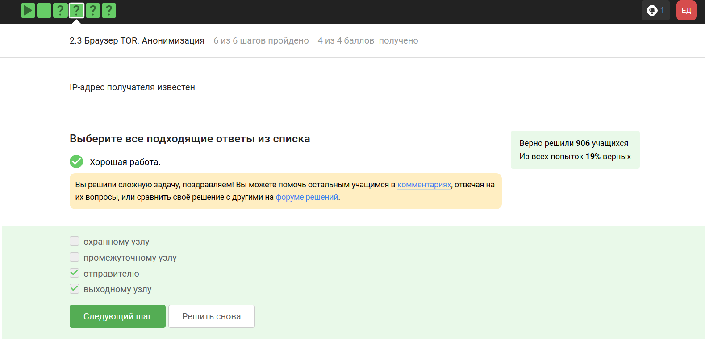{#fig:015 width=70%}

Отправитель генерирует общий секретный ключ со узлами, через которые идет передача, то есть со всеми (рис. [-@fig:016]).

{#fig:016 width=70%}

Для получаения пакетов не нужно использовать TOR. TOR — это технология, которая позволяет с некоторым успехом скрыть личность человека в интернете (рис. [-@fig:017]).

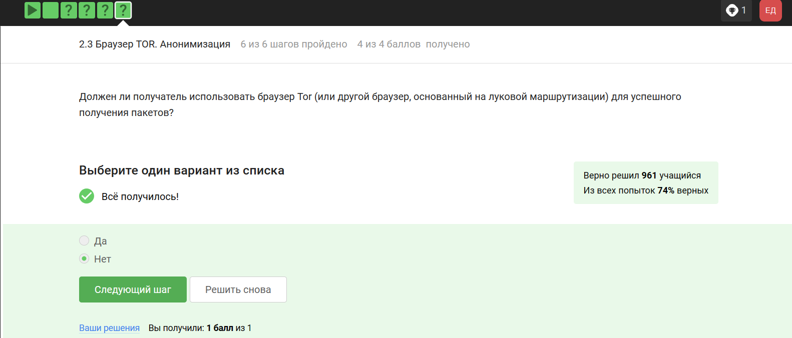{#fig:017 width=70%}

### Беспроводные сети Wi-fi

Действительно, это определение Wi-Fi (рис. [-@fig:018]).

{#fig:018 width=70%}

Для целей работы в Интернете Wi-Fi обычно располагается как канальный уровень (эквивалентный физическому и канальному уровням модели OSI) ниже интернет-уровня интернет-протокола. Это означает, что узлы имеют связанный интернет-адрес, и при подходящем подключении это обеспечивает полный доступ в Интернет. (рис. [-@fig:019]).

{#fig:019 width=70%}

WEP (Wired Equivalent Privacy) – устаревший и небезопасный метод проверки подлинности. Это первый и не очень удачный метод защиты. Злоумышленники без проблем получают доступ к беспроводным сетям, которые защищены с помощью WEP, был заменен остальными представленными (рис. [-@fig:020]).

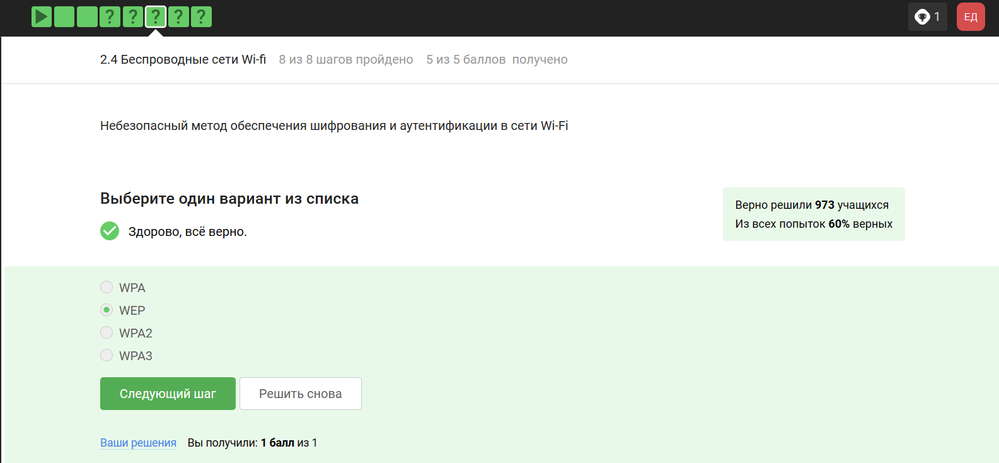{#fig:020 width=70%}

Нужно аутентифицировать устройства и позже передаются зашифрованные данные (рис. [-@fig:021]).

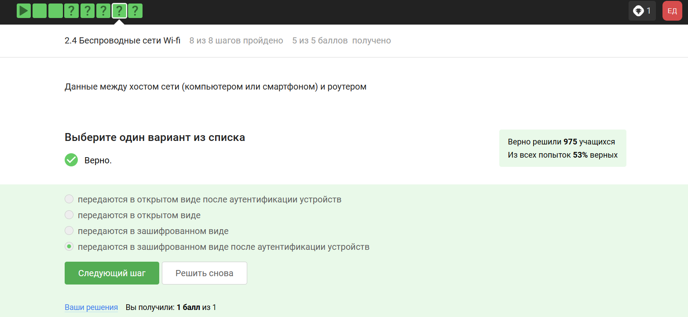{#fig:021 width=70%}

В целом, понятно по названию, что WPA2 Personal для личного использования, то есть для домашней сети, enterprise - для предприятий (рис. [-@fig:022]).

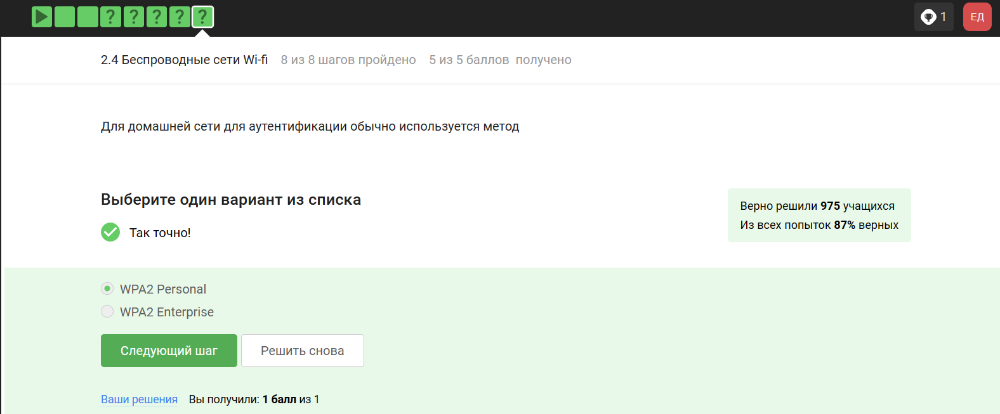{#fig:022 width=70%}

## Этап 2

### Шифрование диска

Шифрование диска — технология защиты информации, переводящая данные на диске в нечитаемый код, который нелегальный пользователь не сможет легко расшифровать. Соответственно, можно (рис. [-@fig:001]).

{#fig:001 width=70%}

Шифрование диска основано на симметричном шифровании (рис. [-@fig:002]).

{#fig:002 width=70%}

Отмечены программы, с помощью которых можно зашифровать жетский диск (рис. [-@fig:003]).

{#fig:003 width=70%}

### Пароли

Стойкий пароль - тот, который тяжлее подобрать, он должен быть со спец. символами и длинный (рис. [-@fig:004]).

{#fig:004 width=70%}

Все варианты, кроме менеджера паролей, совершенно не надежные (рис. [-@fig:005]).

{#fig:005 width=70%}

Капча нужна для проверки на то, что за экраном "не робот"(рис. [-@fig:006]).

{#fig:006 width=70%}

Опасно хранить пароли в открытом виде, поэтому хранят их хэши (рис. [-@fig:007]).

{#fig:007 width=70%}

Соль не поможет (рис. [-@fig:008]).

{#fig:008 width=70%}

Все приведенные меры защищают от утечек данных (рис. [-@fig:009]).

{#fig:009 width=70%}

### Фишинг

Фишинговые ссылки очень похожи на ссылки известных сервисов, но с некоторыми отличиями (рис. [-@fig:010]).

{#fig:010 width=70%}

Да, может, например, если пользователя со знакомым адресом взломали (рис. [-@fig:011]).

{#fig:011 width=70%}

### Вирусы. Примеры

Ответ дан в соответствии с определением (рис. [-@fig:012]).

{#fig:012 width=70%}

Троян маскируется под обычную программу (рис. [-@fig:013]).

{#fig:013 width=70%}

### Безопасность мессенджеров

При установке первого сообщения отправителем формируется ключ шифрования (рис. [-@fig:014]).

{#fig:014 width=70%}

Суть сквозного шифрования состоит в том, что сообщения передаются по узлам связи в зашифрованном виде (рис. [-@fig:015]).

{#fig:015 width=70%}

## Этап 3

### Введение в криптографию
 
Для ответа на вопрос используется определение ассмиетричного шифрования с двумя ключами (рис. [-@fig:001]).

{#fig:001 width=70%}

Отмечены основные условия для криптографической хэш-функции (рис. [-@fig:002]).

{#fig:002 width=70%}

Отмечены алгоритмы цифровой подписи (рис. [-@fig:003]).

{#fig:003 width=70%}

В информационной безопасности аутентификация сообщения или аутентификация источника данных-это свойство, которое гарантирует, что сообщение не было изменено во время передачи (целостность данных) и что принимающая сторона может проверить источник сообщения (рис. [-@fig:004])

{#fig:004 width=70%}

Определение обмена ключами Диффи-Хэллмана. (рис. [-@fig:005]).

{#fig:005 width=70%}

### Цифровая подпись

По определению цифровой подписи протокол ЭЦП относится к протоколам с публичным ключом (рис. [-@fig:006]).

{#fig:006 width=70%}

Алгоритм верификации электронной подписи состоит в следующем. На первом этапе получатель сообщения строит собственный вариант хэш-функции подписанного документа. На втором этапе происходит расшифровка хэш-функции, содержащейся в сообщении с помощью открытого ключа отправителя. На третьем этапе производится сравнение двух хэш- функций. Их совпадение гарантирует одновременно подлинность содержимого документа и его авторства (рис. [-@fig:007]).

{#fig:007 width=70%}

Электронная подпись обеспечивает все указанное, кроме конфиденциальности (рис. [-@fig:008]).

{#fig:008 width=70%}

Для отправки налоговой отчетности в ФНС используется усиленная квалифицированная электронная подпись (рис. [-@fig:009]).

{#fig:009 width=70%}

Верный ответ укзаан на изображении (рис. [-@fig:010]).

{#fig:010 width=70%}

### Электронные платежи

Известные платежные системы - Visa, MasterCard, МИР (рис. [-@fig:011]).

{#fig:011 width=70%}

Верный ответ на изображении (рис. [-@fig:012]).

{#fig:012 width=70%}

При онлайн платежах используется многофакторная аутентификация (рис. [-@fig:013]).

{#fig:013 width=70%}

### Блокчейн

Proof-of-Work, или PoW, (доказательство выполнения работы) — это алгоритм достижения консенсуса в блокчейне; он используется для подтверждения транзакций и создания новых блоков. С помощью PoW майнеры конкурируют друг с другом за завершение транзакций в сети и за вознаграждение.
Пользователи сети отправляют друг другу цифровые токены, после чего все транзакции собираются в блоки и записываются в распределенный реестр, то есть в блокчейн.  (рис. [-@fig:014]).

{#fig:014 width=70%}

Консенсус блокчейна — это процедура, в ходе которой участники сети достигают согласия о текущем состоянии данных в сети. Благодаря этому алгоритмы консенсуса устанавливают надежность и доверие к самоу сети. (рис. [-@fig:015]).

{#fig:015 width=70%}

Ответ - цифровая подпись (рис. [-@fig:016]).

{#fig:016 width=70%}

## Итоги

Спасибо за внимание.
